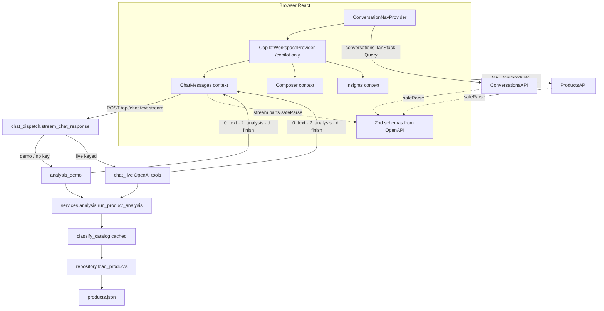

# Architecture

## Overview



HTTP JSON and stream `analysis` parts are validated on the client with Zod schemas generated from Pydantic ([ADR-003](./adr/003-openapi-zod-contracts.md)).

## Principles

1. **Backend owns numbers** — filters, aggregations, KPIs, chartPoints, matchedProductIds.
2. **One chat entry** — typed and voice questions both use `POST /api/chat` with text.
3. **Live when keyed** — `OPENAI_API_KEY` + `DEMO_MODE=false` enables tool calling; otherwise local demo heuristics (also when the key is missing).
4. **Read-only** — no feed writes, approve flow, or external system mutations.
5. **Polish product UI** — frontend labels and backend analysis answers are Polish; docs stay English.
6. **Narrow session surfaces** — shell nav and chat workspace are separate providers; chat mounts only under `/copilot*`.
7. **Contract SoT** — Pydantic → committed OpenAPI → generated Zod only (no hand wire DTOs, no full generated HTTP client).

## Contracts pipeline

```text
Pydantic models (backend/app/models/*)
        │
        ▼
scripts/export_openapi.py  →  contracts/openapi.json
        │
        ▼
scripts/generate_zod_schemas.py  →  frontend/src/contracts/generated/schemas.ts
        │
        ▼
fetchJson(..., schema) · streamEventParser · parseAnalysis
```

Root scripts: `npm run contracts:export | generate | check`. CI regenerates and fails on drift. See [ADR-003](./adr/003-openapi-zod-contracts.md).

## Backend boundaries

| Module | Role |
|--------|------|
| `classify.py` | **Segments only** — `classify_catalog()` `@lru_cache` for process lifetime; `classify_products(explicit)` uncached |
| `services/analysis/` | Public helpers (`apply_filters`, `aggregate_rows`, `group_rows`, …) + `run_product_analysis` |
| `analysis_demo.py` | Local NL → plan; exact `STARTER_CHIP_PLANS` strings first, then regex |
| `analysis_store.py` | In-memory analysis snapshots (`scopeAnalysisId`) |
| `chat_live.py` | OpenAI tool-calling loop (logs failures; soft stream fallback) |
| `chat_dispatch.py` / `stream_orchestrator.py` | Demo vs live routing · stream emit |
| `plan_tool_schema.py` | OpenAI tool enums derived from AnalysisPlan Literals |
| `field_registry.py` | Prompt prose from `FIELD_META` keyed by `PlanField` (coverage test) |
| `metrics.py` / `repository.py` | Profit formula + `products.json` load |
| `models/catalog.py` · `models/analysis.py` · `models/conversation.py` · `models/chat.py` · `models/health.py` | Catalog · plan/result · conversations (`ConversationUpsert = ConversationDetail`) · chat request + stream parts · health |
| `api/health.py` · `api/products.py` · `api/conversations.py` · `api/chat.py` | `GET /health` · catalog · conversations CRUD · streaming chat |

`test_plan_schema_sync` fails CI if tool enums drift from Pydantic Literals. `test_field_registry` fails if `FIELD_META` misses a `PlanField`. Prompt prose in `FIELD_META` is still updated by hand when fields change.

## Frontend layout

Single-feature SPA under `frontend/src/features/copilot/` (no cross-feature `shared/`). Design tokens live in `frontend/src/design/`. Generated contracts live in `frontend/src/contracts/generated/`. Storybook stories stay **co-located** next to components (only components that have stories — not every UI primitive).

```text
contracts/generated/   Zod schemas (AUTO-GENERATED)
features/copilot/
  api/           http.fetchJson, queryKeys, errorCopy + products/health/conversations (Zod)
  types/         thin aliases over generated AnalysisResult / ClassifiedProduct
  components/
    catalog/     ProductCatalogTable, catalogProductFilters (+ stories on table)
    chart/       SpendVsProfitScatter, ScatterTooltip, legend/shape (+ stories)
    insights/    InsightsModal(+View), AnalysisResultSections, InsightSummaryCards,
                 ProductEvidencePanel, MatchedProductsTable (+ stories)
    ui/          BrandMark, MetricTile, StatusPill, PageSection, SegmentBadge
                 (stories: MetricTile, StatusPill — not BrandMark/SegmentBadge)
    workspace/   chat chrome (panel, composer, bubbles, alerts)
  session/       ConversationNavProvider (store + sidebar nav);
                 CopilotWorkspaceProvider (ChatMessages + Composer + Insights; /copilot* only);
                 contexts/ (chatMessages, composer, insights);
                 conversationStoreApi (workspace-only); types, copilotRoutes;
                 public hooks (useConversationNav / useChatRuntime / useComposer / useInsights)
  hooks/         session/* helpers (submit, switch, deferred apply, routing, persistence,
                 registry, store); useCopilotChat; useVoiceCapture; useChatPanelHeight;
                 useCopilotSettings
  lib/
    conversation/  storage (v2 key), merge, bindings, sort, discardUnavailableBackendError
    analysis/      parseAnalysis, matchedProductsFromCatalog, analysisBindings,
                   analysisListCount, matchReasons
    chat/          streamEventParser, messageRole, chatStatus, streamPartType,
                   message helpers, constants, pendingChatApply
    settings/      resolveRuntimeMode
    voice/         speechRecognition, voiceBars, voiceCopy, voiceConstants
    format.ts, segmentMeta.ts, storage/
```

### Frontend session boundaries

| Provider | Mount | Owns |
|----------|-------|------|
| `ConversationNavProvider` | App shell (all routes) | One `useConversationStore` instance, history list, open/delete/startNew; route-derived active id |
| `CopilotWorkspaceProvider` | Nested layout for `/copilot` and `/copilot/c/:id` only | Wires session hooks; exposes **ChatMessages** + **Composer** + **Insights** contexts |

Public hooks: `useConversationNav`, `useChatRuntime` (messages/stream), `useComposer`, `useInsights`. Workspace composition reads the store via `useConversationStoreApi` (not for presentational UI; eslint-restricted). Composer is isolated from messages so keystrokes do not re-render the transcript. Leaving Copilot for Products/Settings unmounts chat/persistence; returning rehydrates from route + local/remote merge.

Domain constants: `MessageRole`, `ChatStatus`, `StreamPartType`, `CATALOG_MATCH_REASON` under `lib/chat/` and `lib/analysis/matchReasons`. Chat status is typed as `ChatStatus` (not bare `string`) through session contexts and helpers.

Offline-first conversation upsert: failures are logged via `discardUnavailableBackendError` and do not interrupt chat (local copy remains authoritative — [ADR-002](./adr/002-ephemeral-conversation-store.md)).

Vitest harness lives in `frontend/test/` (`mocks/handlers.ts` + fixtures, `mocks/server.ts`, `renderWithProviders.tsx`). Co-located `*.test.tsx` / `*.test.ts` stay next to source. Session orchestration + edge races: `session/copilotSession.orchestration.test.tsx`.

Products page uses `useProductsQuery` directly (not the chat workspace). Conversation list/nav stays app-shell-scoped; chat stream, persistence, and analysis insights mount only under `/copilot*`.

Per-turn `analysisId` binds **Zobacz analizę** to that answer’s snapshot. Voice helpers live in `lib/voice/`; `useVoiceCapture` owns lifecycle.

### Session coordination (conceptual)

```text
draft (/copilot)
  → submit → create id + navigate with location.state.skipHydrateFor
  → ready (optimistic messages; no remote hydrate clobber)
hydrating (select history item)
  → GET detail + merge with localStorage → apply
applying (deferred useChat session id after remount)
  → pending apply queue → ready
```

Coordination stays in hooks (refs for hydrate/submit/pending-apply/stale-id guards; **latest-ref** for routing/persistence callbacks) — **not** XState or a runtime phase reducer. Route effect deps are `isDraftRoute` + `routeConversationId` + `skipHydrateFor`. First message uses `location.state.skipHydrateFor` so the route effect does not overwrite the optimistic turn. See [ADR-002](./adr/002-ephemeral-conversation-store.md).

Optimistic list/body: `localStorage` key `pa-copilot-conversations-v2`. Backend store is process-lifetime. Listing merges remote summaries into the sidebar — clearing only `localStorage` is not enough to empty Historia while the API process still holds chats.

Wire list DTOs (`ConversationSummary`, products, health) come from generated Zod; client `ConversationDetail.messages` stay AI SDK `Message[]` after mapping.

## Data

Synthetic `products.json` via `repository.py`. See [DATA.md](./DATA.md). Missing or invalid data returns HTTP 503.
